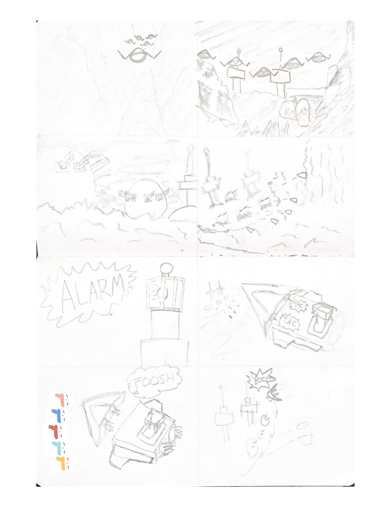

**Name:** Daniel Di Nardi

**Student Number:** C18487682

**Class:** TU858-4 / DT282-4

## Description
An adaptation of the 1978 movie directed by Kinji Fukasaku (who previously directed the movie "Battle Royal").

In this scene, Earths' residents are sending fighters and bombers to an approaching asteroid that hosts a hostile enemy base.

The mission is to destory the enemy before it's too late!

The spaceships will demonstrate steering behaviours covered in the lectures such as wander, offset pursuit, wall avoidance, flocking, and seek.

## Video

Source videos:

## Storyboard

### Event Summary

1. Front shot of fighters travelling through a rocky canyon.
2. Switch to rear shot of fighters sneaking up to enemy platform.
3. Pan shot of turrets waiting.
4. Distant shot of fighters circling enemy and shooting turrets.
5. Shot of alarm ringing.
6. Switch to tower point of view.
7. Switch to turret point of view.
8. Switch to fighter point of view.
9. Front shot of bombers with Earth behind them.
10. Rear shot of bombers approaching canyon.
11. Angled shot of bomber overlooking fight.
12. Bomb detached.
13. Bombs' rockets fire.
14. Bomb and ship move away from one another.
15. Rear view of bomb approaching enemy towers.
16. Angled view of bomb pre-impact.
17. Distant shot of explosion.
18. Cut to bombers and fighters flying back to earth.

## Models

All the models in this project have been made using Blender, the terrain was modelled using Unity, and sound effects are made using SFXR.

## Resources

- Clips and videos: https://www.rollingstone.com/movies/movie-lists/50-best-sci-fi-movies-1970s-163518/message-from-space-1978-174323/
- Assets:
  - Skybox: https://assetstore.unity.com/packages/2d/textures-materials/sky/earth-planets-skyboxes-53752
