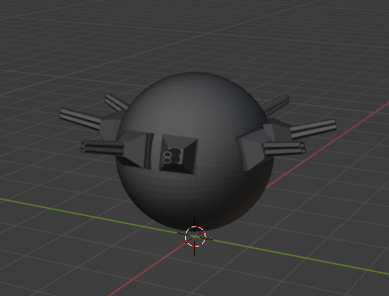
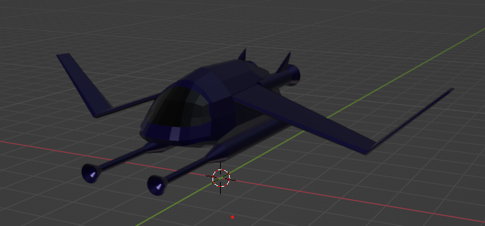
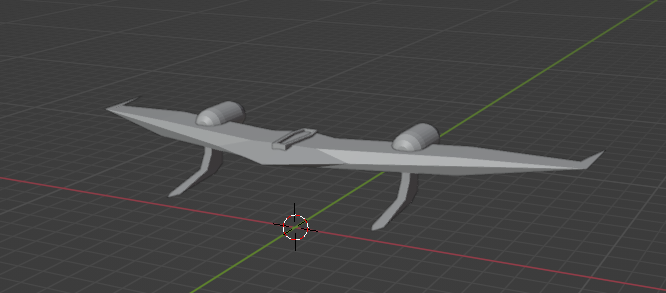
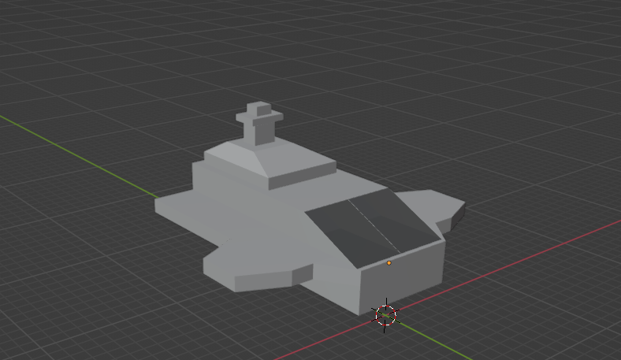
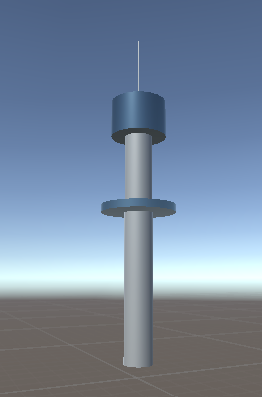
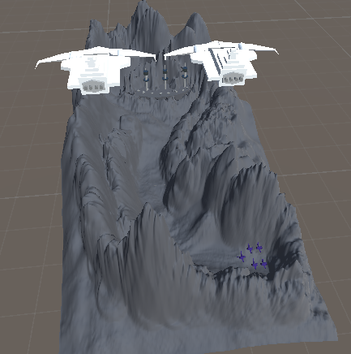
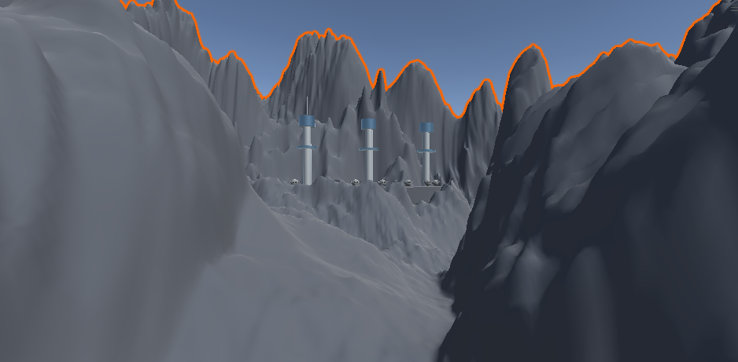
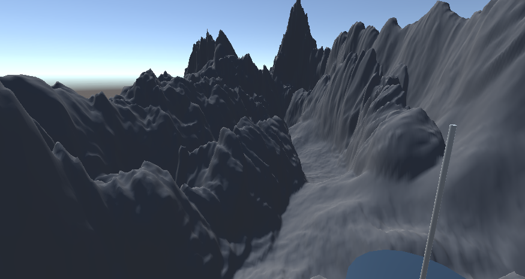

**Name:** Daniel Di Nardi

**Student Number:** C18487682

**Class:** TU858-4 / DT282-4

## Description
An adaptation of the 1978 movie directed by Kinji Fukasaku (who previously directed the movie "Battle Royal").

In this scene, Earths' residents are sending fighters and bombers to an approaching asteroid that hosts a hostile enemy base.

The mission is to destory the enemy before it's too late!

The spaceships will demonstrate steering behaviours covered in the lectures such as wander, offset pursuit, wall avoidance, flocking, and seek.

## Video

Source videos:

## Storyboard

### Event Summary

## Models

All the models in this project have been made using Blender, the terrain was modelled using Unity, and sound effects are made using SFXR.

## Resources
